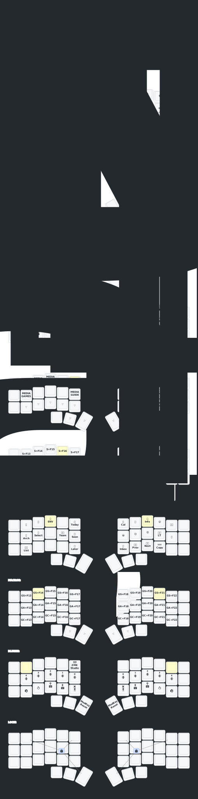

# Heiko's - zmk-crkbd-config

## Overview

The repo contains my personal ZMK keyboard layout.

I am programming in Python, Rust, Bash/POSIX, and a bit of Java.
At the same time I am writing to almost equal degree in Portuguese, English
and German.

Due to that usage pattern I require quick and easy access to all special characters
and numbers used for programming while also allowing the access quickly the Portuguese
accents and German umlauts.
The Portuguese keyboard layout is the most appropriate to cover all necessary symbols.
While the US or even UK English layout is superior for programming, it does not cover
some Portuguese letters like "ç" (C-Cedilha) nor German Umlauts.

For this reason this ZMK keymap assumes the configuration of a PT (Portugal) keyboard
layout (MacOS/Linux/Windows).

Both German and Portuguese keyboard layouts are terrible for programming,
but this is taken care of the the layers. There are some layers for specific
application with bad default support for keyboard centric workflows
(e.g. MS Outlook).

## Sweep/Cradio styple split keyboard

## Corne styple (CRKBD) split keyboard

